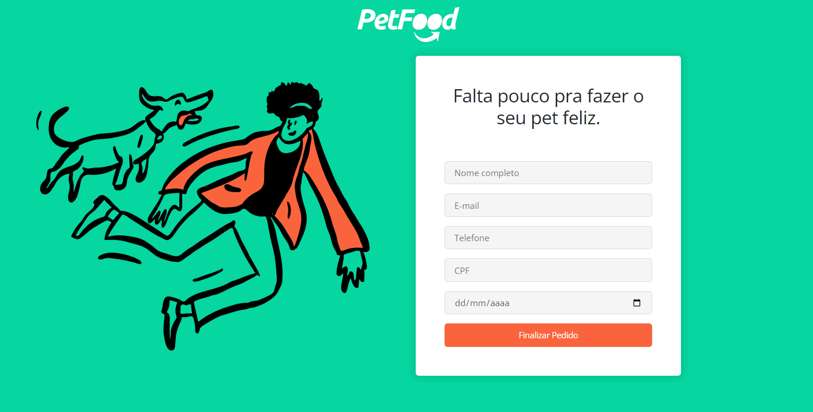
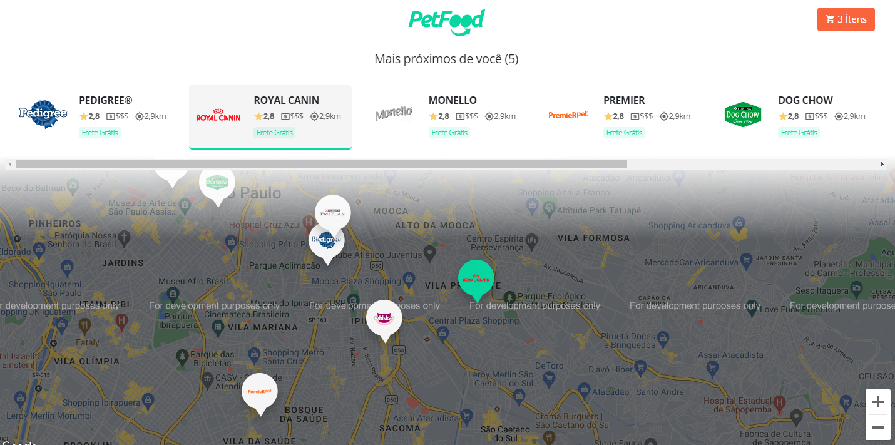
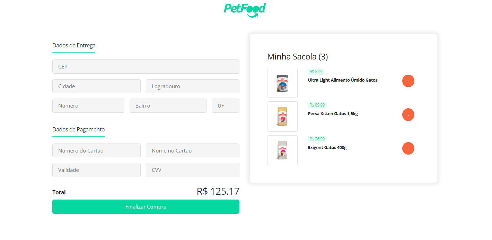
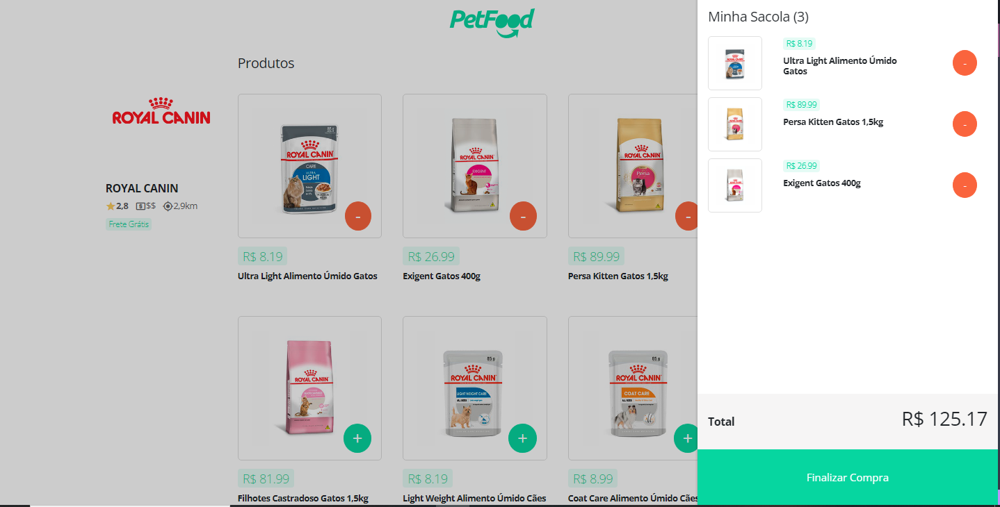

<h1 align="center">
  
</h1>
<h1>
  
</h1>
<h1>
  
</h1>
<h1>
  
</h1>
<h1>
  
</h1>

## Sobre/About

O projeto é um Markeplace de lojas Petshop, com interface simples, limpa e de fácl entrendimento, onde reune as principais marcas para a escolha de preferência do usuário.

The project is a Marketplace for Petshop stores, with a simple, clean and easy-to-understand interface, which brings together the main brands for the user to choose from.

## Ferramentas/Tools

- React
- Node
- html/css
- Express
- Redux
- Bootstrap
- React-Router
- MongoDB

